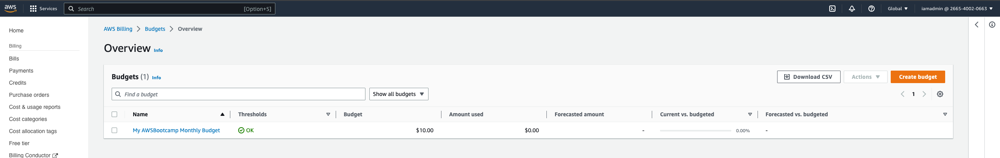
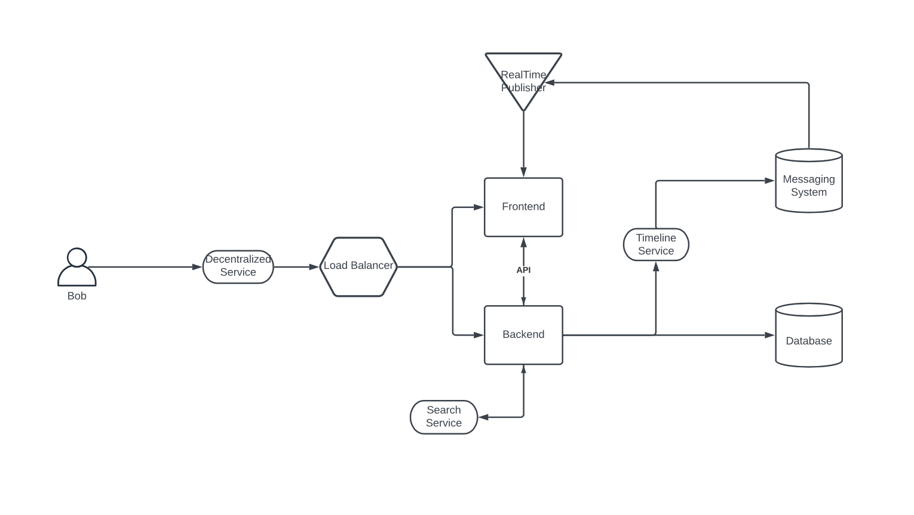
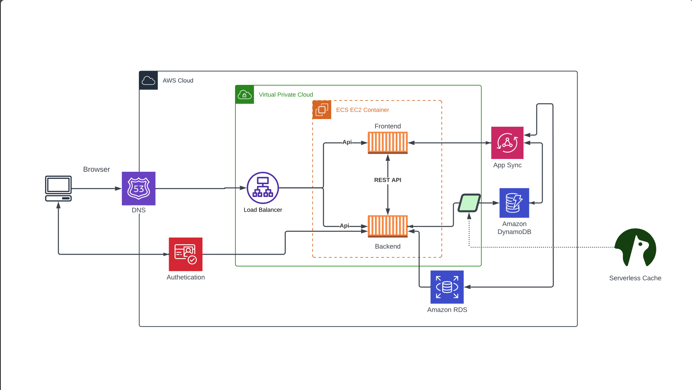

# Week 0 — Billing and Architecture

## Required Homework

### Install and Configure AWS-CLI in Gitpod Workspace
I installed AWS CLI installation process by following the information provided for Linux in the [Documentation page](https://docs.aws.amazon.com/cli/latest/userguide/getting-started-install.html) on the official website.
- Installed AWS CLI in the workspace directory via the command:
```
curl "https://awscli.amazonaws.com/awscli-exe-linux-x86_64.zip" -o "awscliv2.zip"
unzip awscliv2.zip
sudo ./aws/install
```

- Configured CLI to access my AWS account by passing my credentials as Environmental Variable:
```
export AWS_ACCESS_KEY_ID="access-key"
export AWS_SECRET_ACCESS_KEY="secret-key"
export AWS_DEFAULT_REGION="us-east-1"
```
- proof of Configured CLI


### Create Budgets
I created a $10 budget because i was comfortable spending up to that for the duration of the Bootcamp
- I created the budget using the console



### Recreate Conceptual Diagram in Lucid Chart
- I recreated the Conceptual diagram using Lucid chart and saved as pdf



Link to [Conceptual Diagram](https://lucid.app/lucidchart/7e3557eb-b5f2-4ddc-8414-a460fe2dd1f8/edit?invitationId=inv_db9d8ec0-1b66-4bd9-983b-d8707ae24f40)

### Recreate Logical Architecture design in Lucid chart
- I recreated the Logical Architectural design using Lucid chart and saved as pdf



Link to [Logical Diagram](https://lucid.app/lucidchart/e9aea3c1-166b-4ba9-8824-beb65b9e4e5a/edit?invitationId=inv_4a1e1cab-67c2-49aa-b95f-decf8f3e89fa)
